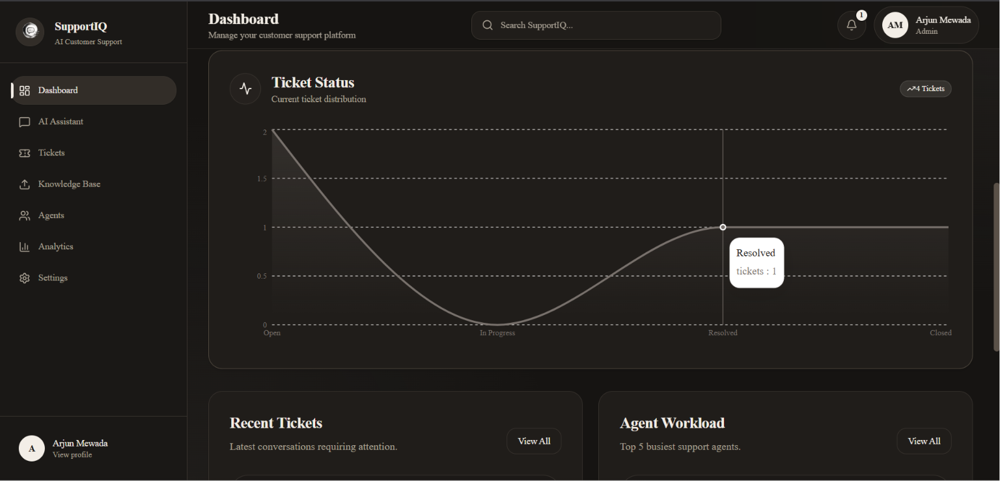
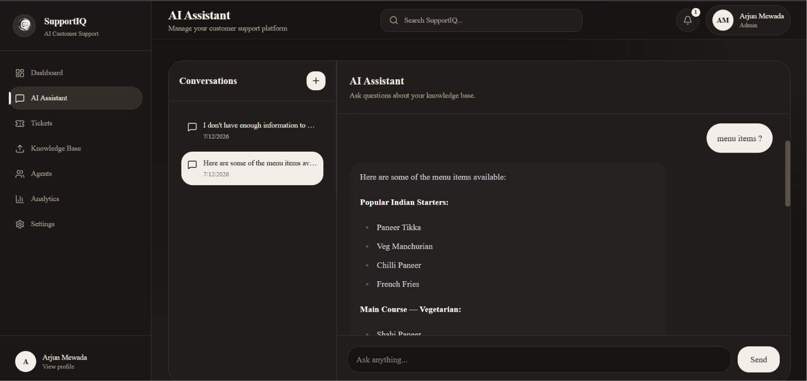
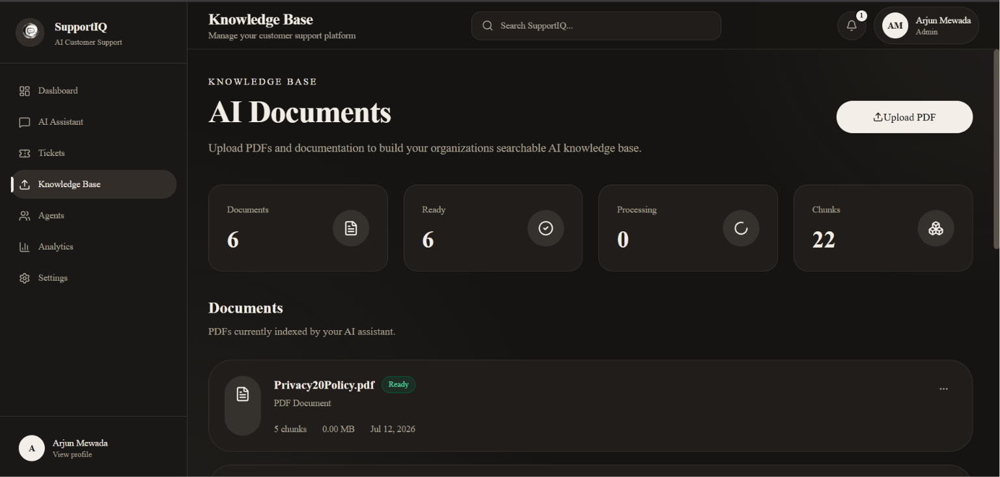
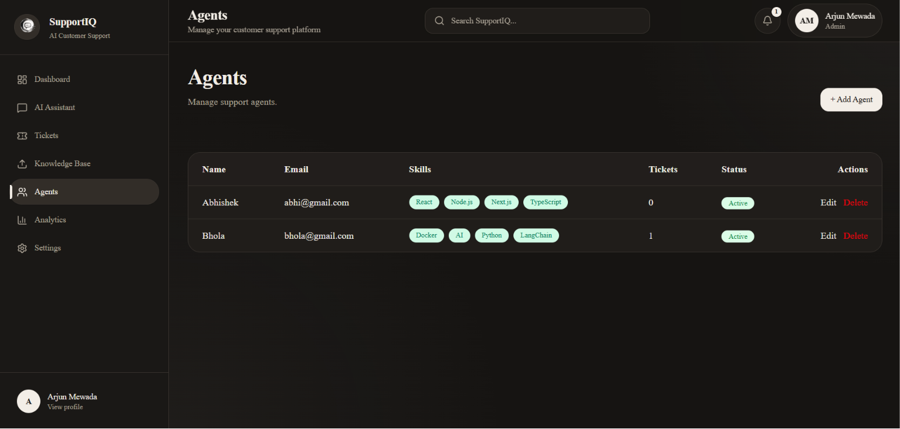
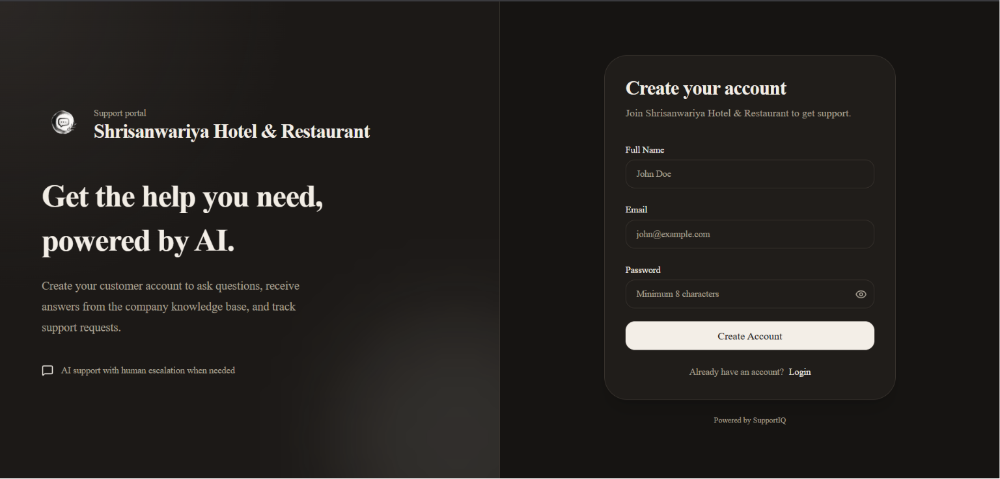

# SupportIQ

> An AI-powered customer support platform that answers customer questions from organization-specific knowledge bases using Retrieval-Augmented Generation (RAG) and escalates unresolved queries to human support agents.

SupportIQ combines AI-powered question answering, document retrieval, ticket management, agent assignment, analytics, and role-based workflows in a single full-stack platform.

## Live Demo

- **Application:** https://support-iq-steel.vercel.app
- **Customer Support Portal:** `/support/[workspace-slug]`
- **GitHub Repository:** Add your GitHub repository URL

> The backend is hosted on a free-tier service, so the first request may take a few seconds while the server starts.

---

## Features

- **RAG-powered AI Assistant** — Answers customer questions using organization-specific knowledge.
- **Knowledge Base Management** — Upload and process PDF documents for AI-powered retrieval.
- **Semantic Search** — Uses vector embeddings and ChromaDB to retrieve relevant document context.
- **AI Ticket Escalation** — Unresolved customer queries can be converted into support tickets.
- **Skill-Based Agent Assignment** — Routes tickets to suitable support agents.
- **Role-Based Access Control** — Separate permissions and dashboards for Admins, Agents, and Customers.
- **Workspace-Specific Support Portals** — Each organization receives a unique `/support/[slug]` customer onboarding page.
- **Multi-Organization Architecture** — Organization data and support workflows remain isolated.
- **Support Analytics** — Track ticket activity, agent workload, and knowledge-base statistics.
- **Secure Authentication** — JWT access and refresh token authentication.

---

## Screenshots

### Admin Dashboard

Monitor tickets, agents, knowledge-base activity, and overall support operations.




(docs/screenshots/dashboard3.png)

### AI Assistant

Customers can ask questions and receive context-aware answers based on the organization's uploaded knowledge base.



### Knowledge Base

Admins can upload and manage PDF documents used by the RAG pipeline.



### Ticket Management

Track customer support requests, priorities, statuses, and agent assignments.


### Agent Management

Manage support agents, skills, availability, and assigned workloads.



### Workspace-Specific Customer Support Portal

Each organization receives a unique public support portal where customers can create an account and access support.



---

## User Roles

### Admin

- Manages the organization workspace
- Uploads and manages knowledge-base documents
- Creates and manages support agents
- Manages customers and support tickets
- Monitors analytics and agent workload

### Agent

- Views assigned support tickets
- Manages customer support requests
- Updates ticket status and progress
- Accesses relevant support tools

### Customer

- Uses the AI assistant
- Receives answers from the organization's knowledge base
- Creates or receives escalated support tickets
- Tracks support requests

---

## Tech Stack

### Frontend

- Next.js
- React
- TypeScript
- Tailwind CSS
- shadcn/ui
- TanStack Query
- React Hook Form
- Zod

### Backend

- Node.js
- Express.js
- TypeScript
- Prisma ORM
- PostgreSQL

### AI & Infrastructure

- Gemini API
- LangChain
- Retrieval-Augmented Generation (RAG)
- ChromaDB
- Cloudinary
- JWT Authentication

### Deployment

- Vercel — Frontend
- Render — Backend
- PostgreSQL — Relational data
- ChromaDB — Vector storage

---

## How It Works

```text
Admin uploads a PDF document
            ↓
Text is extracted from the document
            ↓
Content is split into smaller chunks
            ↓
Gemini generates vector embeddings
            ↓
Embeddings are stored in ChromaDB
            ↓
Customer asks a question
            ↓
Relevant document chunks are retrieved
            ↓
Gemini generates a context-aware response
            ↓
Unresolved queries can become support tickets
            ↓
Tickets are assigned to support agents
```

---

## Customer Onboarding

Each organization receives a unique support portal:

```text
/support/[workspace-slug]
```

For example:

```text
/support/shrisanwariya-hotel-restaurant
```

The customer onboarding flow is:

```text
Organization Support Portal
            ↓
Customer Registration
            ↓
Customer Login
            ↓
AI Assistant
            ↓
Support Ticket Escalation
            ↓
Human Agent Support
```

This allows multiple organizations to provide their own customer support experience through SupportIQ.

---

## Authentication & Authorization

SupportIQ uses JWT-based authentication with access and refresh tokens.

Authorization is enforced using role-based access control:

```text
ADMIN
├── Dashboard
├── AI Assistant
├── Tickets
├── Knowledge Base
├── Agents
├── Customers
├── Analytics
└── Settings

AGENT
├── Dashboard
├── AI Assistant
└── Tickets

CUSTOMER
├── Dashboard
├── AI Assistant
└── Tickets
```

Protected backend routes validate both authentication and user roles before allowing access to sensitive operations.

---

## Project Structure

```text
SupportIQ/
├── client/
│   ├── app/
│   ├── components/
│   ├── features/
│   └── lib/
│
├── server/
│   ├── prisma/
│   └── src/
│       ├── database/
│       ├── modules/
│       ├── shared/
│       └── utils/
│
├── docs/
│   └── screenshots/
│
└── README.md
```

---

## Local Setup

### 1. Clone the repository

```bash
git clone https://github.com/soham1006/SupportIQ
cd SupportIQ
```

### 2. Install frontend dependencies

```bash
cd client
npm install
```

### 3. Install backend dependencies

```bash
cd ../server
npm install
```

### 4. Configure environment variables

Create the required `.env` files for the frontend and backend using the provided `.env.example` files.

The application requires configuration for:

- PostgreSQL
- JWT authentication
- Gemini API
- ChromaDB
- Cloudinary
- Frontend and backend URLs

Do not commit real API keys or secrets.

### 5. Generate the Prisma client

```bash
cd server
npx prisma generate
```

### 6. Run database migrations

```bash
npx prisma migrate dev
```

### 7. Start the backend

```bash
npm run dev
```

### 8. Start the frontend

Open another terminal:

```bash
cd client
npm run dev
```

The frontend will be available at:

```text
http://localhost:3000
```

---

## Core Workflow

```text
Create Organization
        ↓
Upload Knowledge Documents
        ↓
Create Support Agents
        ↓
Share Organization Support Portal
        ↓
Customer Joins Workspace
        ↓
Customer Uses AI Assistant
        ↓
Unresolved Issue Becomes a Ticket
        ↓
Ticket Is Assigned to an Agent
        ↓
Admin Monitors Support Operations
```

---

## Future Improvements

- Streaming AI responses
- Background document processing
- Real-time ticket notifications
- Advanced support analytics
- Email-based customer notifications

---

## Author

**Soham Mewada**

Built as a full-stack AI project demonstrating:

- Retrieval-Augmented Generation
- Vector search and embeddings
- AI integration with Gemini
- Multi-role authentication and authorization
- Multi-organization application architecture
- REST API development
- PostgreSQL database design
- Full-stack production deployment

---

## License

This project is licensed under the MIT License.