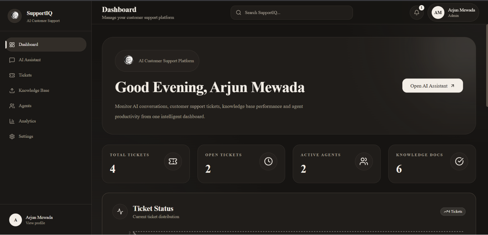
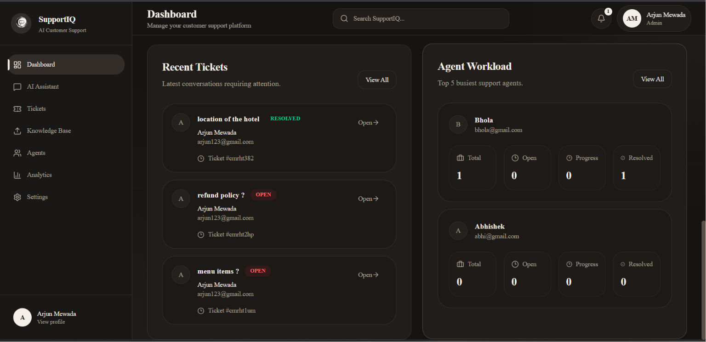
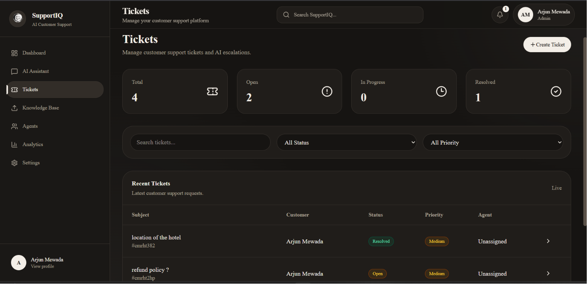
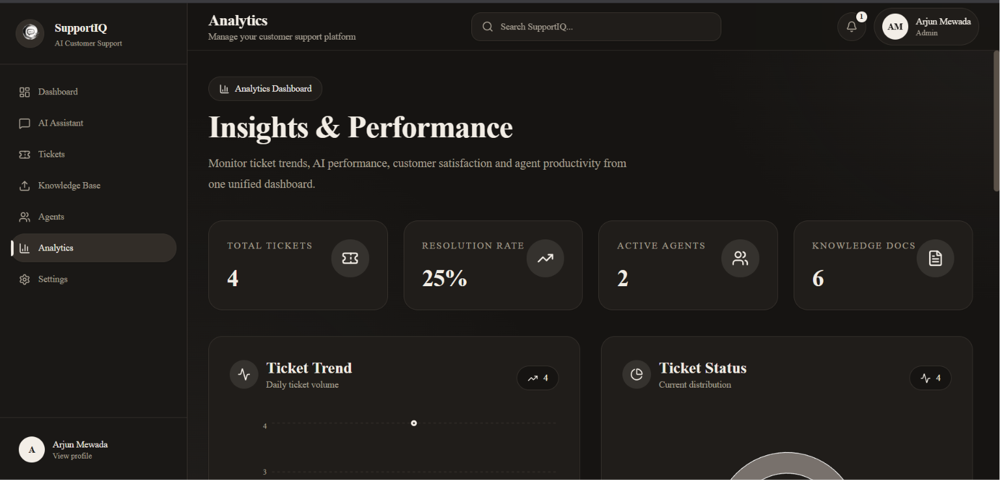
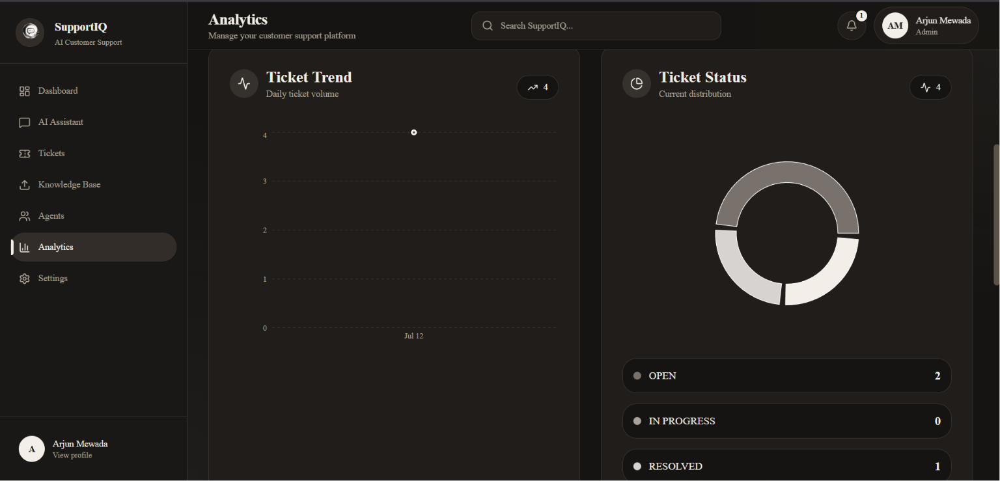
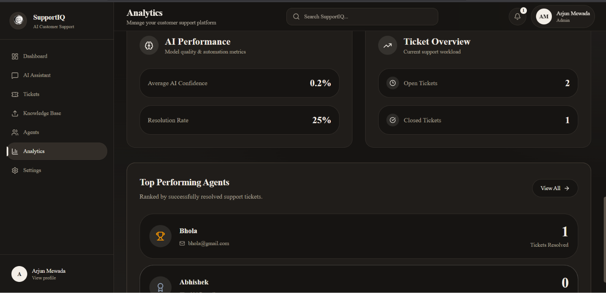

# SupportIQ

> An AI-powered customer support platform that answers customer questions from organization-specific knowledge bases using Retrieval-Augmented Generation (RAG) and supports escalation to human support agents.

SupportIQ combines AI-powered question answering, document retrieval, ticket management, agent assignment, analytics, and role-based workflows in a single full-stack platform.

## Live Demo

- **Application:** https://support-iq-steel.vercel.app
- **Customer Support Portal:** https://support-iq-steel.vercel.app/support/shrisanwariya-hotel-restaurant
- **GitHub Repository:** https://github.com/soham1006/SupportIQ

> The backend is hosted on a free-tier service, so the first request may take a few seconds while the server starts.

---

## Features

- **RAG-Powered AI Assistant** — Answers questions using context retrieved from organization-specific knowledge.
- **Knowledge Base Management** — Upload and process PDF documents for AI-powered retrieval.
- **Semantic Search** — Uses vector embeddings and ChromaDB to retrieve relevant document context.
- **Ticket Escalation** — Unresolved customer queries can be converted into support tickets.
- **Agent Assignment** — Supports routing and assigning support tickets to agents.
- **Role-Based Access Control** — Provides separate permissions and experiences for Admins, Agents, and Customers.
- **Workspace-Specific Support Portals** — Gives each organization a unique `/support/[slug]` customer onboarding page.
- **Multi-Organization Architecture** — Isolates organization data and support workflows between workspaces.
- **Support Analytics** — Tracks ticket activity, agent workload, performance, and knowledge-base statistics.
- **Secure Authentication** — Uses JWT access and refresh tokens with protected backend routes.

---

## Screenshots

### Admin Dashboard

Monitor tickets, agents, knowledge-base activity, and overall support operations.






### AI Assistant

Ask questions and receive context-aware answers based on the organization's uploaded knowledge base.


### Knowledge Base

Upload and manage PDF documents used by the RAG pipeline.


### Ticket Management

Track customer support requests, priorities, statuses, and agent assignments.



### Analytics

Monitor support insights, ticket performance, and top-performing agents.







### Agent Management

Manage support agents, skills, availability, and assigned workloads.


### Workspace-Specific Customer Support Portal

Each organization receives a unique public support portal where customers can create an account and access support.


---

## User Roles

### Admin

- Manages the organization workspace
- Uploads and manages knowledge-base documents
- Creates and manages support agents
- Manages customers and support tickets
- Monitors analytics and agent workload

### Agent

- Views assigned support tickets
- Manages customer support requests
- Updates ticket status and progress
- Accesses relevant support tools

### Customer

- Uses the AI assistant
- Receives answers from the organization's knowledge base
- Accesses support tickets
- Tracks support requests

---

## Tech Stack

### Frontend

- Next.js
- React
- TypeScript
- Tailwind CSS
- shadcn/ui
- TanStack Query
- React Hook Form
- Zod

### Backend

- Node.js
- Express.js
- TypeScript
- Prisma ORM
- PostgreSQL

### AI & Infrastructure

- Gemini API
- LangChain
- Retrieval-Augmented Generation (RAG)
- ChromaDB
- Cloudinary
- JWT Authentication

### Deployment

- **Vercel** — Frontend
- **Render** — Backend
- **PostgreSQL** — Relational data
- **ChromaDB** — Vector storage

---

## How It Works

```text
Admin uploads a PDF document
            ↓
Text is extracted from the document
            ↓
Content is split into smaller chunks
            ↓
Gemini generates vector embeddings
            ↓
Embeddings are stored in ChromaDB
            ↓
Customer asks a question
            ↓
Relevant document chunks are retrieved
            ↓
Gemini generates a context-aware response
            ↓
Unresolved queries can become support tickets
            ↓
Tickets are assigned to support agents
```

---

## Customer Onboarding

Each organization receives a unique public support portal:

```text
/support/[workspace-slug]
```

Example:

```text
/support/shrisanwariya-hotel-restaurant
```

The customer onboarding flow is:

```text
Organization Support Portal
            ↓
Customer Registration
            ↓
Customer Login
            ↓
AI Assistant
            ↓
Support Ticket
            ↓
Human Agent Support
```

This allows customers to join the correct organization without being manually created by an administrator.

---

## Authentication & Authorization

SupportIQ uses JWT-based authentication with access and refresh tokens.

Authorization is enforced through role-based access control:

```text
ADMIN
├── Dashboard
├── AI Assistant
├── Tickets
├── Knowledge Base
├── Agents
├── Customers
├── Analytics
└── Settings

AGENT
├── Dashboard
├── AI Assistant
└── Tickets

CUSTOMER
├── Dashboard
├── AI Assistant
└── Tickets
```

Protected backend routes validate authentication and user roles before allowing access to restricted operations.

Organization-level filtering keeps workspace data isolated between different organizations.

---

## Architecture

SupportIQ follows a modular full-stack architecture:

```text
Admin / Agent / Customer
          │
          ▼
   Next.js Frontend
          │
          ▼
    Express REST API
       │        │
       ▼        ▼
 PostgreSQL   ChromaDB
   (Prisma)   (Vectors)
       │
       ▼
   Gemini AI
```

The backend separates responsibilities using:

```text
Route
  ↓
Controller
  ↓
Service
  ↓
Repository
  ↓
Database
```

For a detailed architecture overview, see [`docs/architecture.md`](docs/architecture.md).

---

## Project Structure

```text
SupportIQ/
├── client/
│   ├── app/
│   ├── components/
│   ├── features/
│   ├── lib/
│   └── .env.example
│
├── server/
│   ├── prisma/
│   ├── src/
│   │   ├── database/
│   │   ├── modules/
│   │   ├── shared/
│   │   └── utils/
│   └── .env.example
│
├── docs/
│   ├── architecture.md
│   ├── case-study.md
│   └── screenshots/
│
├── LICENSE
└── README.md
```

---

## Local Setup

### Prerequisites

Make sure you have:

- Node.js installed
- PostgreSQL database access
- Gemini API credentials
- ChromaDB credentials
- Cloudinary credentials

### 1. Clone the repository

```bash
git clone https://github.com/soham1006/SupportIQ.git
cd SupportIQ
```

### 2. Install frontend dependencies

```bash
cd client
npm install
```

### 3. Install backend dependencies

From the project root:

```bash
cd server
npm install
```

### 4. Configure environment variables

Create environment files from the provided examples:

```text
client/.env.example
server/.env.example
```

Create the corresponding local `.env` files and add your own credentials.

The application requires configuration for:

- PostgreSQL
- JWT authentication
- Gemini API
- ChromaDB
- Cloudinary
- Frontend and backend URLs

> Never commit real API keys, database credentials, or other secrets.

### 5. Generate the Prisma client

From the `server` directory:

```bash
npx prisma generate
```

### 6. Run database migrations

```bash
npx prisma migrate dev
```

### 7. Start the backend

```bash
npm run dev
```

The backend runs on:

```text
http://localhost:5000
```

### 8. Start the frontend

Open another terminal from the project root:

```bash
cd client
npm run dev
```

The frontend runs on:

```text
http://localhost:3000
```

---

## Core Workflow

```text
Create Organization
        ↓
Upload Knowledge Documents
        ↓
Create Support Agents
        ↓
Share Organization Support Portal
        ↓
Customer Joins Workspace
        ↓
Customer Uses AI Assistant
        ↓
Unresolved Issue Becomes a Ticket
        ↓
Ticket Is Assigned to an Agent
        ↓
Admin Monitors Support Operations
```

---

## Security

SupportIQ includes:

- Password hashing
- JWT access and refresh tokens
- Protected API routes
- Role-based authorization
- Organization-level data isolation
- Request validation with Zod
- Restricted CORS configuration
- Environment-based secret management

---

## Case Study

The project case study covers the problem, implementation approach, result, and key technical learnings.

See [`docs/case-study.md`](docs/case-study.md).

---

## Future Improvements

- Streaming AI responses
- Background document processing
- Real-time ticket notifications
- Advanced analytics and reporting
- Email-based customer notifications

---

## Author

**Soham Mewada**

SupportIQ was built as a full-stack AI project demonstrating:

- Retrieval-Augmented Generation
- Vector search and embeddings
- Gemini AI integration
- Multi-role authentication and authorization
- Multi-organization application architecture
- REST API development
- PostgreSQL database design
- Full-stack production deployment

---

## Acknowledgements

SupportIQ was submitted as part of the **Digital Heroes Full Stack Developer Trial**.

---

## License

This project is licensed under the [MIT License](LICENSE).