# SupportIQ

> **An AI-powered customer support agent that understands organization-specific knowledge, resolves customer questions using RAG, takes support actions, and escalates unresolved issues to human agents.**

SupportIQ is a full-stack AI customer support platform designed around an **agentic support workflow**.

Instead of functioning as a simple chatbot, SupportIQ combines:

- AI-powered question answering
- Retrieval-Augmented Generation (RAG)
- Semantic knowledge retrieval
- Support ticket creation
- Ticket assignment
- Human-agent escalation
- Multi-organization workspaces
- Role-based workflows
- Support analytics

The goal is to move from **AI that only answers questions** to **AI that can participate in and complete support workflows**.

---

# 🏆 Build Fast with AI — AI Build Challenge 2026

## Problem Statement

### Autonomous Agents for Everyday Apps

> Build an AI agent that plans and completes real-world tasks across apps using browser automation, MCP, connectors, or APIs, with human approval for risky actions.

## How SupportIQ Addresses the Problem

SupportIQ applies an agentic workflow to customer support.

The AI receives a customer request, retrieves relevant organization-specific information, determines whether the request can be resolved from the available context, and initiates the appropriate support workflow.

When the AI cannot reliably resolve the request, the workflow is escalated to a human support agent.

### Agent Workflow

```text
Customer Request
       ↓
Understand Intent
       ↓
Retrieve Relevant Knowledge
       ↓
AI Reasoning
       ↓
Determine Next Action
       ↓
┌───────────────────────┐
│ Can AI resolve it?    │
└───────────┬───────────┘
            │
       ┌────┴────┐
       ↓         ↓
    Resolve   Escalate
       ↓         ↓
 AI Response  Create Ticket
                  ↓
             Human Agent
                  ↓
              Resolution
```

This workflow allows SupportIQ to combine **retrieval, reasoning, action selection, and human escalation** instead of providing answers in isolation.

---

# 🎥 Demo

### Live Application

https://support-iq-steel.vercel.app

### Customer Support Portal

https://support-iq-steel.vercel.app/support/shrisanwariya-hotel-restaurant

### GitHub Repository

https://github.com/soham1006/SupportIQ

> The backend is hosted on a free-tier service, so the first request may take a few seconds while the server starts.

---

# 🤖 Why SupportIQ Is an AI Agent

SupportIQ is built around an action-oriented customer-support workflow.

The system performs the following steps:

| Agent Capability | SupportIQ |
|---|---|
| Understand customer requests | ✅ |
| Retrieve relevant knowledge | ✅ |
| Generate context-aware responses | ✅ |
| Determine whether an issue can be resolved | ✅ |
| Create support tickets | ✅ |
| Assign tickets to human agents | ✅ |
| Preserve support context | ✅ |
| Escalate unresolved issues | ✅ |
| Support human-in-the-loop workflows | ✅ |

The AI agent uses the organization's knowledge base as its source of context rather than relying only on general model knowledge.

---

# 🧠 Core AI Workflow

SupportIQ uses Retrieval-Augmented Generation to ground AI responses in organization-specific information.

```text
Admin uploads knowledge document
              ↓
        Text extraction
              ↓
       Text chunking
              ↓
      Gemini embeddings
              ↓
       ChromaDB storage
              ↓
      Customer question
              ↓
      Semantic retrieval
              ↓
 Relevant knowledge chunks
              ↓
        Gemini AI
              ↓
    Context-aware response
              ↓
     Resolution decision
              ↓
   ┌──────────┴──────────┐
   ↓                     ↓
Resolved             Unresolved
   ↓                     ↓
Customer             Support Ticket
Response                  ↓
                     Human Agent
```

---

# 🚀 Key Features

## AI Support Agent

Answers customer questions using organization-specific knowledge retrieved through RAG.

## Knowledge Base Management

Administrators can upload and manage PDF documents that become part of the organization's AI knowledge base.

## Semantic Search

Uses vector embeddings and ChromaDB to retrieve relevant information from uploaded documents.

## Ticket Escalation

When a customer issue cannot be resolved through the AI workflow, it can be converted into a support ticket.

## Agent Assignment

Support tickets can be routed and assigned to human support agents.

## Human-in-the-Loop Support

AI handles routine knowledge-based support while unresolved issues can be transferred to human agents.

## Role-Based Access Control

Separate workflows and permissions are provided for:

- Admins
- Agents
- Customers

## Workspace-Specific Support Portals

Each organization receives a unique customer-facing support portal.

Example:

```text
/support/shrisanwariya-hotel-restaurant
```

## Multi-Organization Architecture

Organization data and support workflows are isolated between different workspaces.

## Support Analytics

Tracks:

- Ticket activity
- Agent workload
- Support performance
- Knowledge-base statistics

## Secure Authentication

Uses JWT access and refresh tokens with protected backend routes.

---

# 👥 User Roles

## Admin

- Manages the organization workspace
- Uploads and manages knowledge-base documents
- Creates and manages support agents
- Manages customers
- Manages support tickets
- Monitors analytics
- Monitors agent workload

## Agent

- Views assigned support tickets
- Manages customer support requests
- Updates ticket status
- Tracks support progress
- Accesses relevant support tools

## Customer

- Uses the AI support agent
- Receives answers based on the organization's knowledge base
- Creates and accesses support tickets
- Tracks support requests

---

# 🏗️ Architecture

SupportIQ follows a modular full-stack architecture.

```text
                    ┌───────────────────────────┐
                    │     Admin / Agent /       │
                    │         Customer          │
                    └─────────────┬─────────────┘
                                  │
                                  ▼
                    ┌───────────────────────────┐
                    │       Next.js Frontend    │
                    └─────────────┬─────────────┘
                                  │
                                  ▼
                    ┌───────────────────────────┐
                    │      Express REST API     │
                    └─────────────┬─────────────┘
                                  │
                    ┌─────────────┴─────────────┐
                    ▼                           ▼
          ┌──────────────────┐        ┌──────────────────┐
          │   PostgreSQL     │        │     ChromaDB     │
          │     Prisma       │        │ Vector Storage   │
          └────────┬─────────┘        └────────┬─────────┘
                   │                           │
                   └─────────────┬─────────────┘
                                 ▼
                       ┌──────────────────┐
                       │    Gemini AI     │
                       └──────────────────┘
```

### Backend Architecture

The backend separates responsibilities using:

```text
Route
  ↓
Controller
  ↓
Service
  ↓
Repository
  ↓
Database
```

For additional architecture details:

`docs/architecture.md`

---

# 🔄 End-to-End Support Workflow

```text
Create Organization
        ↓
Upload Knowledge Documents
        ↓
Create Support Agents
        ↓
Share Organization Support Portal
        ↓
Customer Joins Workspace
        ↓
Customer Uses AI Support Agent
        ↓
AI Retrieves Relevant Knowledge
        ↓
AI Generates Context-Aware Response
        ↓
Issue Resolved?
    ┌───────┴───────┐
    │               │
   YES              NO
    │               │
    ↓               ↓
Customer        Create Ticket
Response            ↓
                Assign Agent
                    ↓
              Human Resolution
```

---

# 🌐 Customer Onboarding

Each organization receives a unique public support portal:

```text
/support/[workspace-slug]
```

Example:

```text
/support/shrisanwariya-hotel-restaurant
```

The customer onboarding flow is:

```text
Organization Support Portal
          ↓
Customer Registration
          ↓
Customer Login
          ↓
AI Support Agent
          ↓
Support Ticket
          ↓
Human Agent Support
```

This allows customers to join the correct organization without being manually created by an administrator.

---

# 🔐 Authentication & Authorization

SupportIQ uses JWT-based authentication with access and refresh tokens.

Authorization is enforced through role-based access control.

```text
ADMIN
├── Dashboard
├── AI Assistant
├── Tickets
├── Knowledge Base
├── Agents
├── Customers
├── Analytics
└── Settings

AGENT
├── Dashboard
├── AI Assistant
└── Tickets

CUSTOMER
├── Dashboard
├── AI Assistant
└── Tickets
```

Protected backend routes validate authentication and user roles before allowing access to restricted operations.

Organization-level filtering keeps workspace data isolated between different organizations.

---

# 🖥️ Screenshots

## Admin Dashboard

Monitor tickets, agents, knowledge-base activity, and overall support operations.

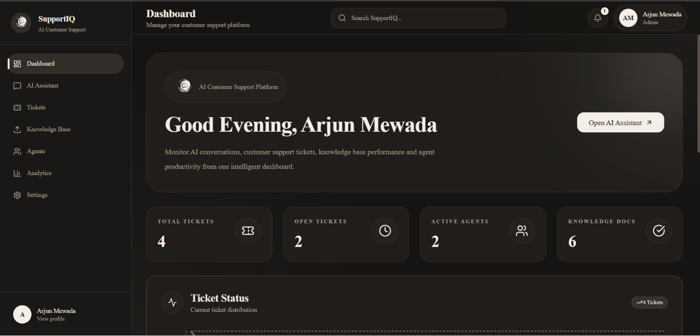

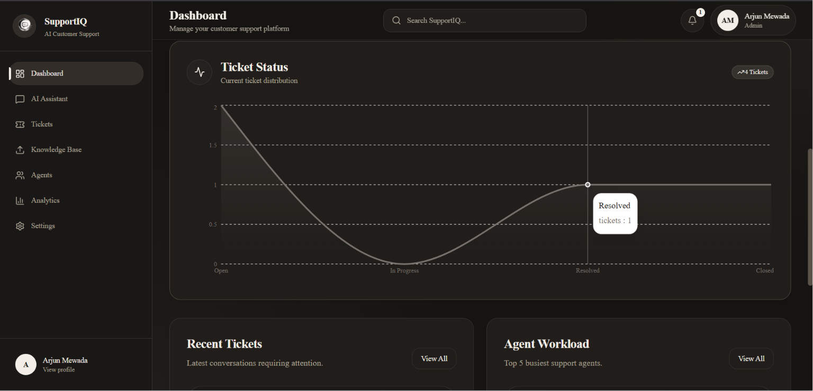

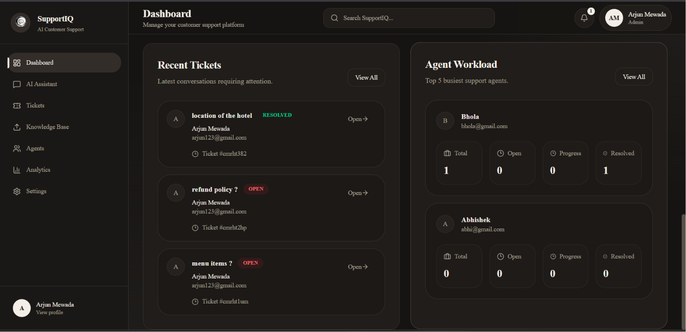

---

## AI Support Agent

Ask questions and receive context-aware answers based on the organization's uploaded knowledge base.

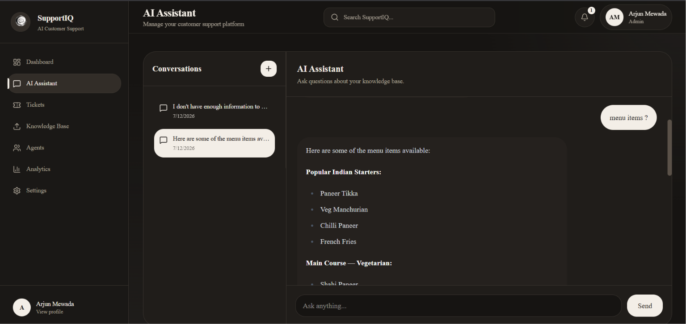

---

## Knowledge Base

Upload and manage PDF documents used by the RAG pipeline.

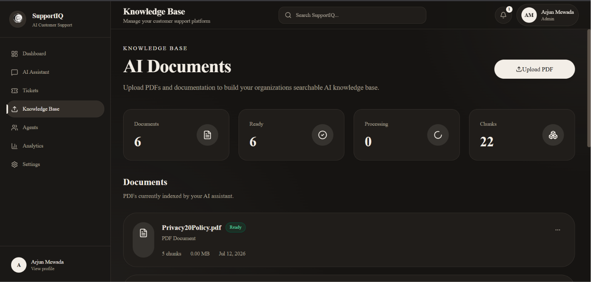

---

## Ticket Management

Track customer support requests, priorities, statuses, and agent assignments.

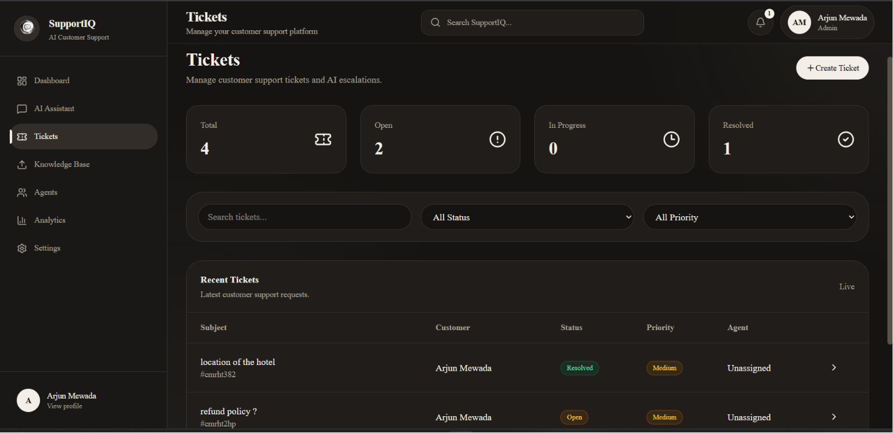

---

## Analytics

Monitor support insights, ticket performance, and top-performing agents.

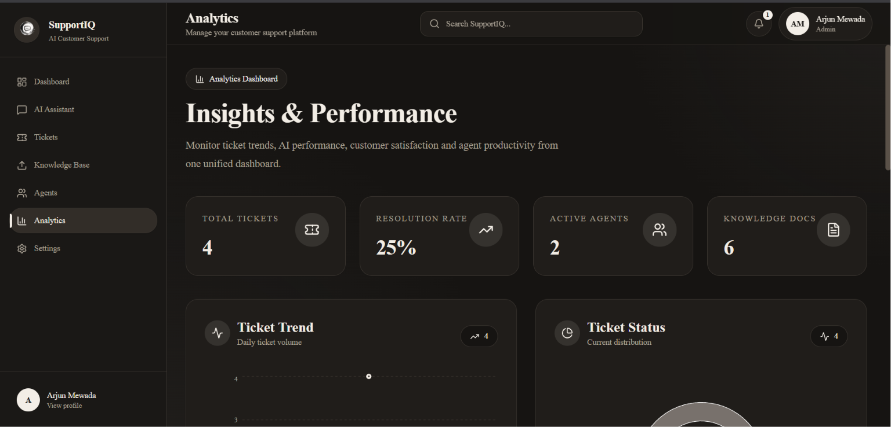

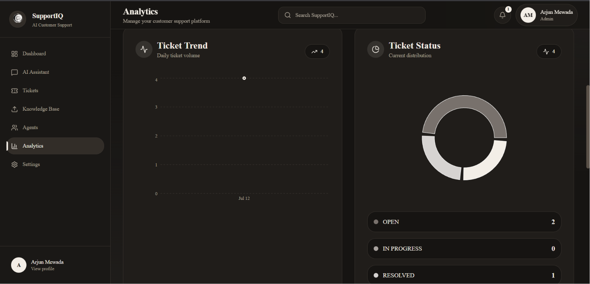

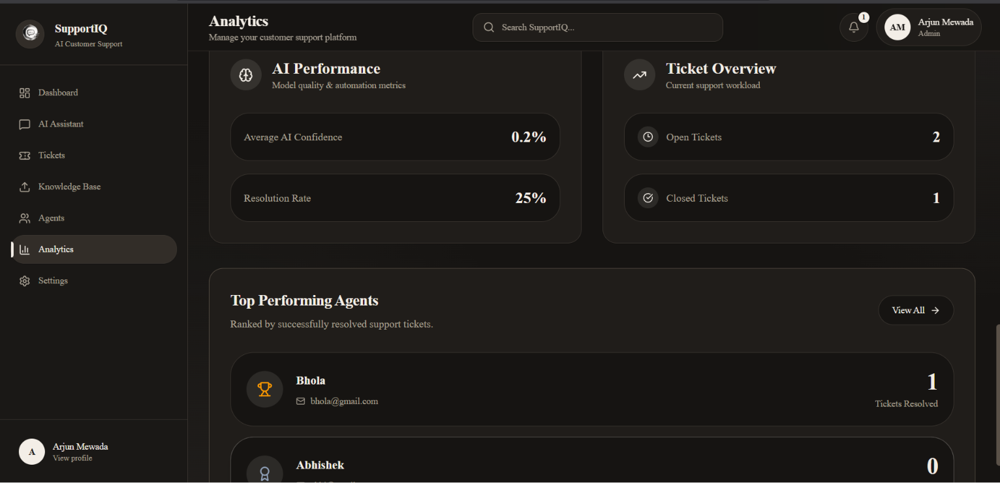

---

## Agent Management

Manage support agents, skills, availability, and assigned workloads.

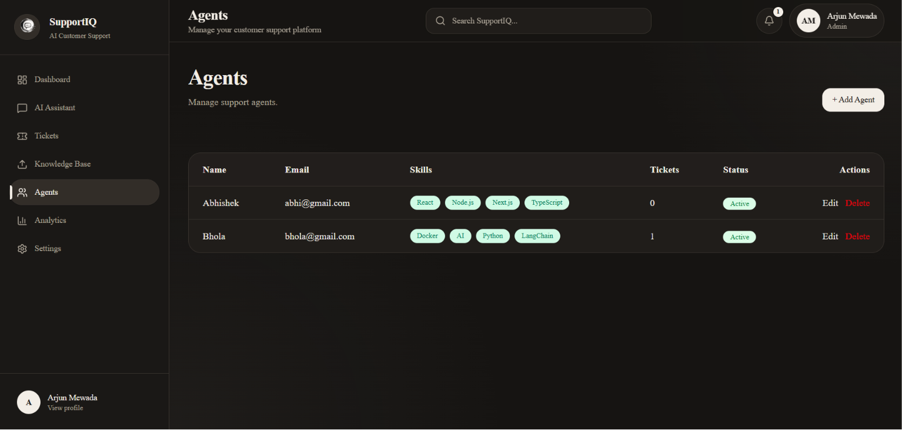

---

## Customer Support Portal

Each organization receives a unique public support portal where customers can create an account and access support.

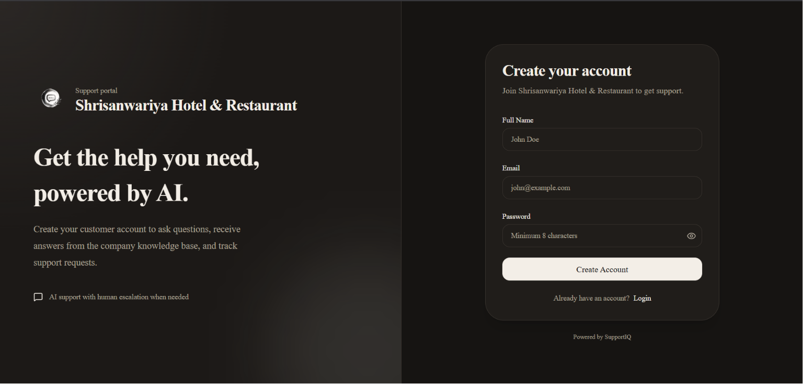

---

# 🛠️ Tech Stack

## Frontend

- Next.js
- React
- TypeScript
- Tailwind CSS
- shadcn/ui
- TanStack Query
- React Hook Form
- Zod

## Backend

- Node.js
- Express.js
- TypeScript
- Prisma ORM
- PostgreSQL

## AI & Infrastructure

- Gemini API
- LangChain
- Retrieval-Augmented Generation (RAG)
- ChromaDB
- Cloudinary
- JWT Authentication

## Deployment

- **Vercel** — Frontend
- **Render** — Backend
- **PostgreSQL** — Relational data
- **ChromaDB** — Vector storage

---

# 📁 Project Structure

```text
SupportIQ/
│
├── client/
│   ├── app/
│   ├── components/
│   ├── features/
│   ├── lib/
│   └── .env.example
│
├── server/
│   ├── prisma/
│   ├── src/
│   │   ├── database/
│   │   ├── modules/
│   │   ├── shared/
│   │   └── utils/
│   └── .env.example
│
├── docs/
│   ├── architecture.md
│   ├── case-study.md
│   └── screenshots/
│
├── LICENSE
└── README.md
```

---

# ⚙️ Local Setup

## Prerequisites

Make sure you have:

- Node.js installed
- PostgreSQL database access
- Gemini API credentials
- ChromaDB credentials
- Cloudinary credentials

---

## 1. Clone the Repository

```bash
git clone https://github.com/soham1006/SupportIQ.git
cd SupportIQ
```

---

## 2. Install Frontend Dependencies

```bash
cd client
npm install
```

---

## 3. Install Backend Dependencies

From the project root:

```bash
cd server
npm install
```

---

## 4. Configure Environment Variables

Create environment files from the provided examples:

```text
client/.env.example
server/.env.example
```

Create the corresponding local `.env` files and add your own credentials.

The application requires configuration for:

- PostgreSQL
- JWT authentication
- Gemini API
- ChromaDB
- Cloudinary
- Frontend and backend URLs

> Never commit real API keys, database credentials, or other secrets.

---

## 5. Generate Prisma Client

From the `server` directory:

```bash
npx prisma generate
```

---

## 6. Run Database Migrations

```bash
npx prisma migrate dev
```

---

## 7. Start the Backend

```bash
npm run dev
```

The backend runs on:

```text
http://localhost:5000
```

---

## 8. Start the Frontend

Open another terminal from the project root:

```bash
cd client
npm run dev
```

The frontend runs on:

```text
http://localhost:3000
```

---

# 🔒 Security

SupportIQ includes:

- Password hashing
- JWT access and refresh tokens
- Protected API routes
- Role-based authorization
- Organization-level data isolation
- Request validation with Zod
- Restricted CORS configuration
- Environment-based secret management

---

# 🎯 What Makes the Project Different

Traditional customer-support chatbots primarily focus on generating responses.

SupportIQ focuses on the complete support workflow:

```text
Knowledge
   +
AI Reasoning
   +
Action
   +
Ticket Workflow
   +
Human Escalation
```

The system is designed so that AI handles knowledge-based support while human agents remain part of the workflow for unresolved issues.

This creates a practical bridge between:

**AI Chatbots → AI Agents → Human Support Workflows**

---

# 📊 Challenge-Focused Architecture

The core agentic loop can be summarized as:

```text
                    ┌─────────────────────┐
                    │   Customer Request  │
                    └──────────┬──────────┘
                               ↓
                    ┌─────────────────────┐
                    │  Intent / Context   │
                    │     Understanding   │
                    └──────────┬──────────┘
                               ↓
                    ┌─────────────────────┐
                    │ Knowledge Retrieval │
                    │       via RAG       │
                    └──────────┬──────────┘
                               ↓
                    ┌─────────────────────┐
                    │     Gemini AI       │
                    │ Reasoning / Answer  │
                    └──────────┬──────────┘
                               ↓
                    ┌─────────────────────┐
                    │   Action Decision   │
                    └──────────┬──────────┘
                               ↓
                     ┌─────────┴─────────┐
                     ↓                   ↓
               Resolve             Escalate
                     ↓                   ↓
              AI Response          Create Ticket
                                         ↓
                                  Human Agent
                                         ↓
                                     Resolve
```

---

# 🔮 Future Improvements

Potential extensions to make SupportIQ more autonomous include:

- Tool-based AI actions
- MCP integrations
- External application connectors
- Browser-based support workflows
- Automated email notifications
- Calendar and CRM integrations
- Streaming AI responses
- Background document processing
- Real-time ticket notifications
- Advanced analytics and reporting
- Human approval checkpoints for high-impact actions

These extensions would allow SupportIQ to evolve from an AI support platform into a broader **autonomous customer-support agent**.

---

# 📚 Case Study

The project case study covers:

- Problem
- Solution
- Implementation approach
- AI architecture
- Results
- Technical learnings

See:

`docs/case-study.md`

---

# 🏆 Project Summary

SupportIQ demonstrates how AI can move beyond simple question answering and participate in real customer-support workflows.

### Core capabilities

```text
RAG
+
Vector Search
+
AI Reasoning
+
Support Actions
+
Ticket Management
+
Human Escalation
+
Multi-Organization Architecture
```

### Deployment

```text
Frontend  → Vercel
Backend   → Render
Database  → PostgreSQL
Vectors   → ChromaDB
AI        → Gemini
```

---

# 👨‍💻 Author

**Soham Mewada**

SupportIQ was built as a full-stack AI project demonstrating:

- Retrieval-Augmented Generation
- Vector search and embeddings
- Gemini AI integration
- AI-assisted support workflows
- Human-in-the-loop escalation
- Multi-role authentication and authorization
- Multi-organization application architecture
- REST API development
- PostgreSQL database design
- Full-stack production deployment

---

# 📄 License

This project is licensed under the [MIT License](LICENSE).